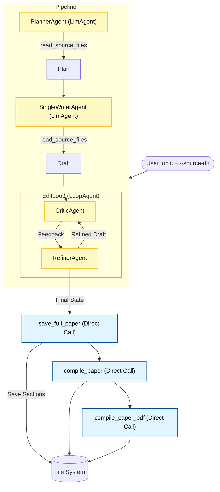

# Research Paper With Sources (v2 - Optimized)

An optimized version of the research paper generator that supports reading local source material and uses direct tool calls for deterministic operations.

## Architecture

This version refactors the pipeline to remove unnecessary LLM agents (`SaverAgent` and `CompilerAgent`).



## What's New in v2

This version refactors the architecture to be more efficient, cost-effective, and reliable by removing unnecessary LLM intermediaries.

- **Sources Support**: Uses `read_source_files` tool to ingest local context (notes, data).
- **Efficient Pipeline**: Reasoning steps are LLM-based, while file saving and compilation are direct Python calls in `main.py`.
- **Reduced Latency & Cost**: Saves 2 LLM API calls per execution.
- **Improved Reliability**: Eliminates the risk of the LLM hallucinating during basic tool execution commands.

## Setup

1. Configure your `.env` file with your Gemini API key.
2. Install dependencies:
   ```bash
   pip install -r requirements.txt
   brew install pandoc
   pip install weasyprint
   ```

## Usage

```bash
python main.py "Your topic" --source-dir ./sample_research
```

The tool will:
1. Read all files in `./sample_research`.
2. Plan the paper using those sources.
3. Write and refine the paper.
4. Deterministically save and compile the final PDF.
